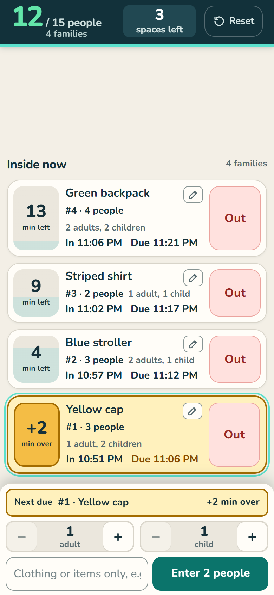
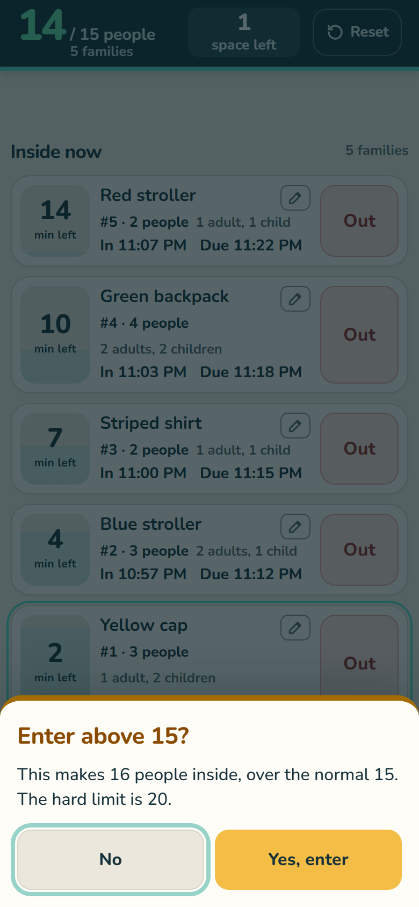
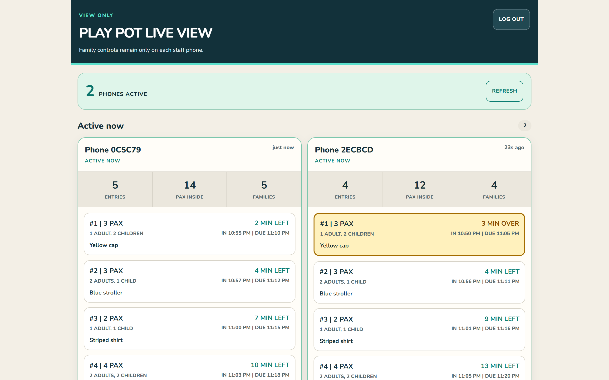

# Play Pot: live capacity and family timers

A mobile web app I built to replace manual session tracking at the Play Pot area of **Children's Museum Singapore**, where I work on the front line. It has been piloted by the front-line team on shift since **August 2026**.

<p>
  
  &nbsp;
  
</p>


<sub>Screenshots use made-up demo families.</sub>

## The problem

Play Pot runs timed sessions for families, with a normal capacity of 15 people and a hard maximum of 20. Staff were tracking sessions manually. At any moment they had to know how many people were inside, when each family came in, and whose 15 minutes were up, all while running the floor.

## What the app does

| Need on the floor | What the app does |
|---|---|
| Know the headcount instantly | Shows a live count against capacity (e.g. **12 / 15 people, 3 spaces left**). |
| Don't go over capacity | Entry above 15 needs a second confirmation. New entry above 20 is always blocked. |
| Know whose time is up | Gives every family a 15-minute timer and lists families by due time. The next family due sits right above the entry button, and overdue families turn amber. |
| Work one-handed on a busy floor | Keeps the main actions (enter, next check-out) in thumb reach, with large buttons and plain wording. |
| Recover from mistakes | Asks for confirmation before check-out, offers undo, and keeps a 15-minute "Checked out" recovery list to put a family back inside. |
| Let the supervisor see all phones | Provides a password-protected, **view-only** live dashboard across staff phones. |
| Protect visitors' privacy | Identifies families only by a short clothing description, never names, photos or ticket numbers. Checked-out records are deleted after 15 minutes, and the live view expires after 12 hours. |

## How I developed it

1. **Spotted the problem on shift:** staff were tracking Play Pot sessions manually.
2. **Turned the operating rules into software:** 15 people normal, 20 maximum and 15-minute sessions are all enforced by the app and pinned by automated tests.
3. **Piloted it with the front-line team** (August 2026), with staff using it on shift, and **iterated on their feedback**. For example, I moved the entry and next check-out buttons into thumb reach, rewrote the labels in plain staff wording, added a Reset button for a clean slate, and made the look calmer. Three alternative layouts were prototyped along the way (branches `proto/a`, `proto/b`, `proto/c`).
4. **Reviewed it:** a written audit with the fix status of each finding is in [docs/audit-2026-09-23.md](docs/audit-2026-09-23.md).
5. **Moved hosting** to a self-managed Cloudflare Workers deployment.

I defined the requirements and operating rules and gathered staff feedback. The code was written with AI coding assistants (Claude and ChatGPT).

## Tech

- **App:** React 19, TypeScript, vinext (a Next.js-style framework on Vite), and an installable web app (PWA).
- **Data:** each phone keeps its own record in the browser, and syncing is best-effort, so a dropped connection doesn't stop staff from recording entries. An anonymous read-only copy syncs to **Cloudflare D1** (SQLite) for the owner's live view.
- **Hosting and security:** Cloudflare Workers. Staff and owner sessions use signed (HMAC-SHA-256) cookies, and secrets live in Cloudflare, not in the code.
- **Quality:** 29 automated tests (`node:test`) cover the capacity rules, timers, numbering, reset, the live view and shift safety.

## Run it locally

```bash
pnpm install --frozen-lockfile
cp .env.example .dev.vars   # then fill in your own demo PIN, session secret and owner password
pnpm run dev
pnpm test
```

## More

- [Staff guide](docs/staff-guide.md): the full operating rules, written for staff.
- [Audit, 23 September 2026](docs/audit-2026-09-23.md): findings and fix status.
